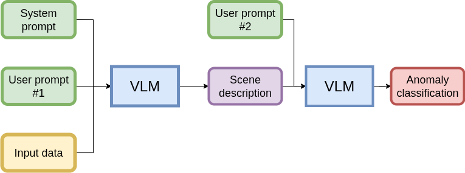

Generic Principles
==================

Situation understanding within the CONVINCE project consists in detecting, identifying and mitigating anomalies. The context being robotic systems performing a task, anomalies correspond to failures
that may occurre and interrupt the nominal behaviour of the robot while performing its computed task.

Within this project we focus on the identification of anomalies. Anomalies are failures
that we thought about and compiled within a list, added to it an unknown class that 
represents all the others. The identification process relies on a neural network 
approaches based on visual language models (VLM).

We have chosen to operate the following model : `Qwen2.5-VL-7B`_. Which needs to be hosted on a 
machine (usually a distant server). Our configuration is two GPUs Nvidia A100 with 80GB each. The 
session's mounted memory is also needed to be higher than 20GB. 

The model is used to identify the anomaly, it uses visual data, through images/videos 
and proprioception data. The VLM need prompts to put the context and make it return the
desired output. The prompts are composed of a system prompt that explains the system,
available and manipulated objects, the data, some known correlations, the anomalies'
list and examples that give in insight on desired outputs. We use two user prompts, that
in one or two sentences ask for the desired output. The first one ask for an analysis 
organised in a json structure and the second one ask for the anomaly identification within 
the list, see below.

.. _Qwen2.5-VL-7B: https://huggingface.co/Qwen/Qwen2.5-VL-7B-Instruct

This project explains how to deploy your model, by default the same configuration as us, but 
with the flexibility of changing it to the one you want.

It also allows you to do anomalies identification with CONVINCE 3 uses-cases : Vacuum cleaner,
assembly robot and musuem guide.

There is also an explanation of how to include your own use-case.
